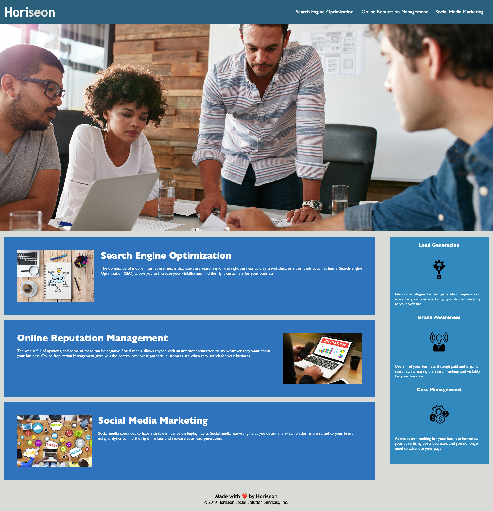

# Horiseon

## Description
As a boot camp student, I’ve refactored existing code for a marketing agency to make the client's homepage more web-accessible. To do this, several requirements must be met as below:

* Chang div tag to semantic HTML to enhance web accessibility, Search Engine Optimization, and readability so that the elements to acting in accordance with a logical structure independent of styling and positioning.
* Sort the heading attributes sequentially.
* Add alt attribute within the Img tags if the image can’t be displayed. 
* Modify the title to Horiseon Social Solution Services for the detailed title.
* Check out that all links are functioning correctly.
* Add comments before each element or section of the page.

## Usage
Live application deployed at: https://oliviasylee.github.io/horiseon/

## Contributing
Olivia Seonyeong Lee

##
If you have any questions about this projects, please contact me at oliviasylee@gmail.com. You can view more of my projects at https://github.com/oliviasylee.
